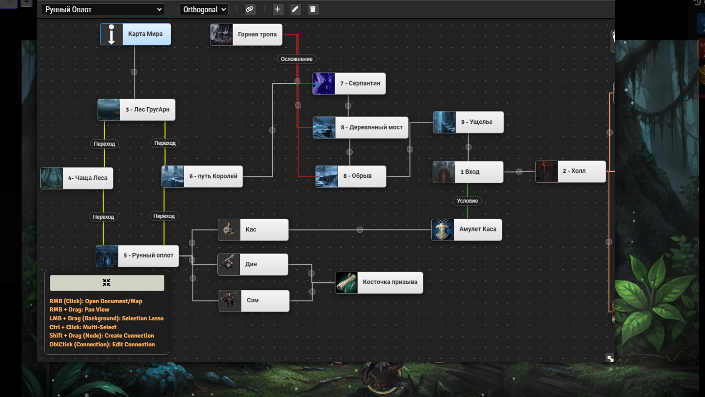

# simple-mindmap

⚙️ **Установка/installation**
Модуль Simple MindMap должен быть доступен для установки через ссылку
`https://raw.githubusercontent.com/Lovebringer-F/simple-mindmap/refs/heads/main/module.json`
The Simple MindMap module can be installed using the following Manifest URL:
`https://raw.githubusercontent.com/Lovebringer-F/simple-mindmap/refs/heads/main/module.json`

## 🚀 Как Запустить Редактор

1.  Зайдите в **Настройки Модулей** (Manage Modules) и найдите **Simple MindMap**.
2.  Нажмите кнопку **"Создать Макрос"** рядом с настройкой модуля.
3.  На вашу панель макросов будет добавлен макрос с названием **Simple_MindMap**. Используйте его для быстрого запуска редактора в любой момент!

# 🧠 Simple MindMap

**Простой инструмент для создания интерактивных ментальных карт (Mind Maps) прямо внутри Foundry VTT.**

Модуль позволяет вам визуально связывать Актеров, Журналы, Предметы и другие документы VTT, а также создавать ссылки на другие карты. Идеально подходит для планирования сюжета, визуализации связей NPC или отслеживания кампаний!

## ✨ Основные Функции

---

### ✍️ Интуитивный Редактор

* **Перетаскивание (Drag & Drop):** Перетаскивайте **любые документы Foundry VTT** (Акторы, Журналы, Предметы, Ролл-таблицы и т.д.) прямо на холст, чтобы создать новый узел карты.
* **Интерактивные Узлы:**
    * **Открытие Документа:** Щелкните правой кнопкой мыши на узел, чтобы мгновенно открыть связанный документ Foundry VTT.
    * **Ссылки на Карты:** Создавайте специальные узлы, которые служат прямыми ссылками на другие карты в вашем модуле, позволяя строить многоуровневую структуру.
* **Навигация:**
    * **Панорамирование (Panning):** Перемещайтесь по холсту с помощью **правой кнопки мыши**.
    * **Масштабирование (Zoom):** Используйте **колесико мыши** для увеличения или уменьшения масштаба.

---

### 🔗 Соединения (Связи)

* **Простое Создание Связей:** Нажмите **Shift** и перетащите линию от одного узла к другому, чтобы создать соединение.
* **Стили Линий:** Выбирайте один из трех стилей для ваших связей, чтобы лучше передать их характер:
    * **Curve** (Кривая Безье)
    * **Straight** (Прямая)
    * **Orthogonal** (Ломаная)
* **Редактирование Связей:** **Двойной клик** по соединению позволяет изменить его текст и цвет.

---

### 🖱️ Инструменты Выделения и Удаления

* **Групповое Выделение:** Используйте **Лассо** (прямоугольник выделения), чтобы выбрать сразу несколько узлов для их перемещения.
* **Удаление:** Нажмите клавишу **Delete**, чтобы удалить все выделенные узлы и связанные с ними соединения.

---

**EN**

## 🚀 How to Launch the Editor

1. Go to **Manage Modules** and find **Simple MindMap**.
2. Click the **"Create Macro"** button next to the module setting.
3. A macro named **Simple_MindMap** will be added to your macro bar. Use it to quickly launch the editor at any time!

# 🧠 Simple MindMap

**A simple tool for creating interactive Mind Maps right inside Foundry VTT.**

The module allows you to visually link Actors, Journals, Items, and other VTT documents, as well as create links to other maps. Perfect for plotting campaigns, visualizing NPC connections, or tracking quest lines!

## ✨ Key Features

---

### ✍️ Intuitive Editor

* **Drag & Drop:** Drag **any Foundry VTT documents** (Actors, Journals, Items, Roll Tables, etc.) directly onto the canvas to create a new map node.
* **Interactive Nodes:**
    * **Open Document:** Right-click on a node to instantly open the linked Foundry VTT document.
    * **Map Links:** Create special nodes that serve as direct links to other maps in your module, allowing you to build a multi-level structure.
* **Navigation:**
    * **Panning:** Move around the canvas using the **right mouse button**.
    * **Zooming:** Use the **mouse wheel** to zoom in or out.

---

### 🔗 Connections (Links)

* **Easy Connection Creation:** Press **Shift** and drag a line from one node to another to create a connection.
* **Line Styles:** Choose one of three styles for your connections to better convey their nature:
    * **Curve** (Bezier Curve)
    * **Straight** (Straight Line)
    * **Orthogonal** (Right-Angle Line)
* **Editing Connections:** **Double-click** on a connection to edit its text and color.

---

### 🖱️ Selection and Deletion Tools

* **Group Selection:** Use the **Lasso** (selection rectangle) to select multiple nodes at once for moving.
* **Deletion:** Press the **Delete** key to remove all selected nodes and their associated connections.

