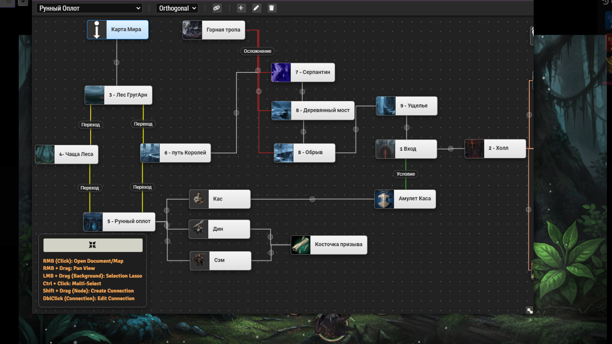

# simple-mindmap

⚙️ **Установка/installation**
Модуль Simple MindMap должен быть доступен для установки через ссылку
`https://raw.githubusercontent.com/Lovebringer-F/simple-mindmap/refs/heads/main/module.json`
The Simple MindMap module can be installed using the following Manifest URL:
`https://raw.githubusercontent.com/Lovebringer-F/simple-mindmap/refs/heads/main/module.json`

Simple MindMap is a lightweight yet powerful tool for creating mind maps, relationship charts, quest logs, and investigation boards right inside Foundry VTT. The module operates extremely fast, as all editing rights are strictly restricted to the Gamemaster (GM), and players only see what they are allowed to see, with no delays or desyncs.

Below is a complete list of the module's features.

🎛 Main Interface & Navigation

Floating Button: Access the module via a convenient floating button that can be dragged to any corner of the screen. If it ever gets lost off-screen, there's a "Reset floating button" checkbox in the module settings.

Custom Map Center: You can set the perfect zoom and camera position for each map, then click the "Crosshairs" 🎯 button in the interface. Now, the view reset button will always return you to this saved angle.

Free Navigation:

RMB + Drag: Pan the canvas.

Mouse Wheel: Zoom in / out.

LMB on background: Lasso selection.

Ctrl + Click: Multi-select several objects.

Delete: Remove all selected objects.

🗂 Map Elements (Nodes, Fields, and Text)

Drag & Drop Integration: Simply drag any Actor, Item, Journal Entry, RollTable, or Scene from the Foundry sidebar directly onto the canvas. The module will automatically create a card with the portrait and name. Double-clicking the portrait will open the corresponding sheet/journal! (Note: dragging a token out of the card onto the scene works correctly and does not accidentally move the card itself).

Text Blocks: Just want to add a header? Create a text node. You can change its size, text color, background color, and even the font (Signika, Arial, Times New Roman, Modesto).

Fields (Groups): Allow you to visually group elements together. You can customize the border color, fill opacity, and even set a background image (URL) that beautifully blends with the chosen color.

Links to other maps: You can create portal-cards that transport you to another mind map on double-click. Perfect for multi-level investigations!

🔗 Advanced Connections & Branches

Creating Connections: Hold Shift and click on a card, then click on another card to connect them.

Interactive Attachment Points: The endpoints where a connection attaches to a card are now interactive. They turn bold on hover. Pull the endpoint to:

Detach the connection and reconnect it to a different card.

Delete the connection by simply dropping the endpoint in an empty space on the canvas.

Branches (Forks): Hold Shift and click on the central block of an existing connection to pull a new line from it. Great for creating flowcharts where one event leads to three different outcomes!

Line Customization: You can change the style (Solid, Dashed, Dotted), shape (Curve, Straight, Orthogonal), and color. You can also toggle an arrow at the end.

Bare Lines: If a connection (or branch) has no label and no notes, the central UI block is not rendered, leaving a beautiful bare line. To open its settings, simply double-click the line itself.

Compact UI: For labeled connections, the control buttons (pin, visibility toggle) are hidden and only appear on hover to avoid cluttering the map.

📝 Smart Notes System

Now every card, text block, field, and even connection has a built-in notes system!

Smart Autosize: Cards automatically grow in height to accommodate all note items. You won't have to scroll through a tiny internal block. (An inner scrollbar will only appear if you manually shrink the card via the bottom-right corner).

Connection Notes: Labels under connections have received a beautiful visual container (border, background, and shadow), making the text readable over any intersecting lines.

GM Secrets: When adding a note, the GM can check the "GM" box — this item will then only be visible to them.

Authorship tracking: Below each note, it shows who left it (however, in the current architecture, only the GM can edit the map).

👁‍🗨 Visibility Control (Fog of War for mind maps)

GM-Only Architecture: Players only see what you show them. Editing is completely disabled for players for perfect performance.

Hiding Elements: Every element (card, connection, text, field) has an "Eye" icon. In one click, you can hide or show the element to players.

Cascading Hiding: * If you hide a Field (Group), all cards and connections inside it are automatically hidden from players.

If you hide a card — all connections leading to it also disappear for players.

If you hide the entire map (via the top panel) — players will see a message that the map is temporarily hidden by the GM.
